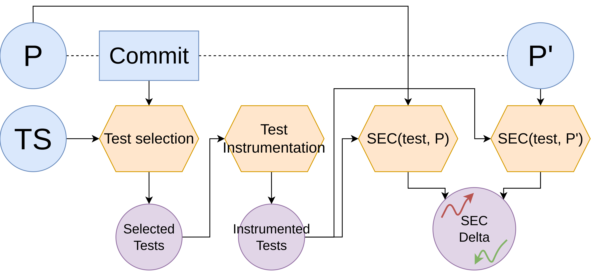
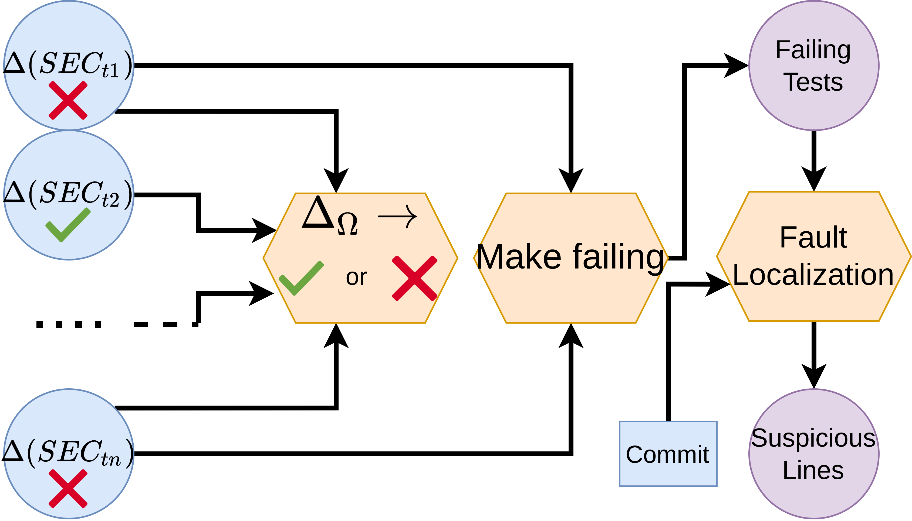

# Detailed Documentation

Calling this maven plugin will apply the whole process as follows:

1. test-selection: select the tests that execute the code changes (this is done by `diff-test-selection`);
2. [instrumention](./instrumentation.md): instrument the selected tests with probes to measure their energy consumption;
3. [delta](./delta.md): computation of the energy consumption delta test-wise (&Delta;SEC(t) = SEC(v2,t) - SEC(v1,t));
4. [mark](./mark.md): apply a strategy to mark as passing :heavy_check_mark: or failing :x: the commit;
5. [failer](./failer.md): instrument the tests that have a positive &Delta, meaning that are consuming energy after applying the commit;
6. [suspect](./suspect.md): run fault localization to rate the modified line according to their suspiciousness;
7. [report](./report.md): generate a readable report;

For more information, you can view a dedicated README for each step, however, we advise you to **not** run the steps
individually since they are made to work together.

`Diff-jjoules` offers an extra feature which the mutation of the source code in order to introduce artificial energy
regression. Please, see the dedicated [documentation](./mutation.md) for more information.

## Approach

The approach is divided into 2 workflows:

For the first workflow, we have the `test-selection`, then the [instrumention](./instrumentation.md) and eventually
the [delta](./delta.md) computation as shown in the figure below:



For the second workflow, we have the [mark](./mark.md) to decide to break the build or not, the [failer](./failer.md)
and eventually [suspect](./suspect.md) as shown in the figure below:



There is one extra step to [report](./report.md) formatted result.

## Options

### Maven plugins options

```text
diff-jjoules:diff-jjoules
  Implementation: fr.davidson.diff.jjoules.DiffJJoulesMojo
  Language: java

  Available parameters:

    iterations (Default: 5)
      User property: iterations
      Number of execution to do to measure the energy consumption of tests.

    measureEnergyConsumption (Default: false)
      User property: measure
      (no description available)

    outputPath (Default: diff-jjoules)
      User property: output-path
      Specify the path to output the files that produces this plugin

    pathDirSecondVersion
      Required: true
      User property: path-dir-second-version
      Specify the path to root directory of the project in the second version.

    pathToReport (Default: .github/workflows/template.md)
      User property: path-to-report
      Specify the path to output the report

    pathToRepositoryV1
      User property: path-repo-v1
      Specify the path to the root directory of the project before applying the
      commit. This is useful when it is used on multi-modules project.

    pathToRepositoryV2
      User property: path-repo-v2
      Specify the path to the root directory of the project after applying the
      commit. This is useful when it is used on multi-modules project.

    reportType (Default: MARKDOWN)
      User property: report
      Specify the type of report to generate

    shouldMark (Default: true)
      User property: mark
      Enable or disable the mark (and the suspect and the failer) goals when
      running diff-jjoules

    shouldSuspect (Default: true)
      User property: suspect
      Enable or disable the suspect (and failer) goals when running
      diff-jjoules
```

### Jar Options

```text
Usage: fr.davidson.diff.jjoules.Main [-hV] [--junit4] [--mark] [--measure] [--report] [--suspect]
                                     [--cohen-s-d=<cohensD>] -f=<pathToFirstVersion> [-i=<iterations>]
                                     [--mark-strategy=<markStrategyEnum>] [-o=<output>]
                                     [--path-report-file=<pathToReport>] [--path-repository-v1=<pathToRepositoryV1>]
                                     [--path-repository-v2=<pathToRepositoryV2>] [--report-type=<reportEnum>]
                                     -s=<pathToSecondVersion> [--test-filter-type=<testFilterEnum>]
                                     [--wrapper=<wrapperEnum>]
      --cohen-s-d=<cohensD>
                          Specify the threshold of the Cohen's D Default value: 0.8
  -f, --path-first-version=<pathToFirstVersion>
                          Path to the first version of the program.
  -h, --help              Show this help message and exit.
  -i, --iteration=<iterations>
                          Number of test executions to measure their energy consumption.
      --junit4            Enable junit4 tests
      --mark              Enable mark step.
      --mark-strategy=<markStrategyEnum>
                          Specify the mark strategy to be used.Valid values: STRICT, CODE_COVERAGE, DIFF_COVERAGE,
                            ORIGINAL Default value: ORIGINAL
      --measure           Enable the energy consumption measurements of Diff-JJoules Default value: false
  -o, --output=<output>   Path to the output folder.
      --path-report-file=<pathToReport>
                          Path to report file to produce.
      --path-repository-v1=<pathToRepositoryV1>
                          Path to the first version of the program that contains .git (this is used for multi-module
                            projects)
      --path-repository-v2=<pathToRepositoryV2>
                          Path to the second version of the program that contains .git (this is used for multi-module
                            projects)
      --report            Enable report step (the mark step must be enabled).
      --report-type=<reportEnum>
                          Specify the report type to produce.Valid values: TEXTUAL, MARKDOWN, NONE Default value:
                            TEXTUAL
  -s, --path-second-version=<pathToSecondVersion>
                          Path to the second version of the program.
      --suspect           Enable suspect step.
      --test-filter-type=<testFilterEnum>
                          Specify the test filter to use for marking.Valid values: ALL, EMPTY_INTERSECTION,
                            STUDENTS_T_TEST Default value: ALL
  -V, --version           Print version information and exit.
      --wrapper=<wrapperEnum>
                          Specify the wrapper to be used.Valid values: MAVEN, PROPERTIES Default value: MAVEN
```